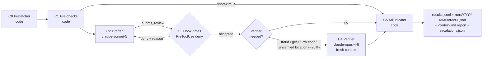

# ORCHESTRATION.md — SafeGuard Grass-Cut QA Agent Architecture

Core architecture blueprint for the agentic build. Built strictly on the **Claude Agent SDK (Python)**; every SDK claim below was verified against the official docs (code.claude.com / platform.claude.com) on 2026-07-13, and every API claim against live calls to test order `500119014`. Companion docs: [AGENT_BEST_PRACTICES.md](AGENT_BEST_PRACTICES.md), [API_DOCUMENTATION.md](API_DOCUMENTATION.md).

**Scope: POC-first** — runnable on one machine against the dev API, with a path-to-production section at the end (§15).

---

## 1. What the agent does

Reviews grass-cut work orders (~25–30k/month, currently ~$100k/month in manual QA). Per the assignment, the agent **always commits to exactly one of three flags** per order — and separately carries a **disposition** saying who acts on the flag:

### Three flags × two dispositions

| Flag | Meaning | Downstream action |
|---|---|---|
| `good_to_pay` | Work verified at the right property, to the good-enough standard | Payment proceeds |
| `gcfu` | Work happened but specific areas out of standard / documentation inadequate or incomplete | GCFU follow-up order |
| `potential_fraud` | Wrong property, fabricated visit, or no meaningful work | Pay → $0, route to Quality Review |

**Disposition** (orthogonal to the flag): `auto` — code acts on the flag directly; `human_review` — a person confirms the flag before it takes effect. Human escalation is **no longer an outcome**: routing to a human never erases the flag (an uncertain GCFU is "GCFU — human review", not a flagless escalation). Disposition becomes `human_review` when the reviewer set `needs_human: true` (extraordinary conditions/ambiguity, reason in `notes_for_human`), confidence is below the flag's `auto_decide` line, drafter and verifier flags disagree, a mandated verifier failed to produce a verdict, or the flag is `potential_fraud` — fraud **always** goes to Quality Review (a human), carrying `fraud_confirmed: true/false` from independent verifier agreement. Full rules in §11.

**Design north star:** the confusion-matrix cell *truth = honest vendor / agent = fraud* must stay ≈ 0. Every architectural layer below is justified by which error it catches.

**Capabilities:** location verification (photo GPS vs property address), time-on-site plausibility, 4-sides + fence-line/foundation coverage, before/after difference analysis, contractor-claim cross-checking, extraordinary-condition detection, calibrated confidence with human escalation, full per-order audit trail, and a **plain-language decision report for every order** (§5.1).

---

## 2. Pipeline at a glance

The system is a **workflow, not a free-roaming agent** (per Anthropic's "Building effective agents": use predefined code paths for predictable steps). All sequencing is plain Python; the LLM runs inside two well-fenced stages. One fresh SDK session per order — zero cross-order contamination. Execution mode (interactive Agent SDK today; batched Messages API as a pre-specified contingency, §7) is a **deployment property of C2/C4 only** — C0/C1/C3/C5/C6 are mode-invariant code.



| # | Component | Kind | Model | Role |
|---|---|---|---|---|
| C0 | Prefetcher | Python (httpx, Pillow) | — | Auth, fetch order + images, download/downscale photos, build `OrderBundle` |
| C1 | Pre-check engine | Python rules | — | Deterministic signals + short-circuits before any LLM spend |
| C2 | Drafter (core reviewer) | Agent SDK session | `claude-sonnet-5` | Vision + rules review; verdict via `submit_review` tool call |
| C3 | Submit gate | `PreToolUse` hook + `PostToolUse` audit hook | — | Deterministically deny non-compliant verdicts, feed reason back |
| C4 | Independent verifier | Agent SDK session, fresh context | `claude-opus-4-8` | Re-derive verdict blind on fraud/GCFU/low-confidence drafts |
| C5 | Adjudicator | Python | — | Thresholds, agreement rules, demotion, final record |
| C6 | Eval harness | Python CLI | — | Golden set, confusion matrix, threshold sweep, regression gate |

**Why this shape** (judged against a cost-first single-agent design and an SDK-native multi-subagent design): it is the only shape where the money-moving decision is *structurally* forced through a deterministic gate with an in-loop feedback channel — verdict = MCP tool call → hook deny with reason → model revises. Sub-agent orchestration by an LLM was rejected (adds cost and non-determinism to a fixed 6-step flow); photo-capping was rejected (partial evidence is exactly how false fraud accusations happen).

---

## 3. Component specs (inputs / outputs)

### C0 — Prefetcher (code)

**Input** (from intake, §4):
```json
{ "order_number": "500119014", "config": "config/qa.yaml", "run_id": "2026-07-13T09:00Z-batch01" }
```

Steps: token from cache (refresh at `exp − 5 min`; 10 h TTL) → `GET /aiapi/luggage/{order}` → `GET /aiapi/images/{order}` → filter photos (`mimeType == "image/jpeg"` **and** `descPrefix ∉ {Bid, Document}` — Bid photos document proposed extra work, not the grass cut itself; on the test order this keeps **32 of 50 items** (7 Before, 4 During, 16 After, 5 Condition)) → download each via `image.sgpdev.com/{webFileName}` (Bearer → 302 → presigned S3, consumed immediately — 300 s TTL, 8-way concurrent) → Pillow: downscale long edge > 1092 px to 1092, JPEG q80 → **document extraction** (previously dropped): download the order's document attachments — vendor "Update" HTML = the full vendor questionnaire (e.g. "Was exterior debris/trash removed? No", backyard confirmation, tree bid amounts + special-equipment reasons, lot dimensions), "Invoice" HTML = line items/amounts/discount + changed-amount comments, "Audit Property Assistant" PDFs = audit reports — dedupe by content sha256 (attachments are often byte-identical duplicates), extract text (HTML via the stdlib parser, PDF via pypdf, first 8 pages), cap 6,000 chars/doc and 18,000 chars total → normalize fields (`answers[0].value`, enum/date/sentinel rules per API_DOCUMENTATION §3.2; `AuditAssistant.Impediment.1–7` → ordered `impediments[]` array).

**Output — `OrderBundle`:**
```json
{
  "order_number": "500119014",
  "fields": {
    "work_code": "GCL", "work_code_desc": "MONTH/BIMONTHLY GRASS CUT",
    "address": "1801 WOODWARD AVE, SPRINGFIELD, OH 45506",
    "time_on_site_min": 38, "number_of_photos": 42,
    "date_grass_cut": "2026-07-08", "completed_date": "2026-07-08",
    "grass_cut_completed": "Yes", "grass_cut_backyard": "Yes",
    "has_violations": "No", "trees_violation_damage": "No", "has_pool_hottub": "No",
    "shrubs_present": "No", "special_instructions": "TEST GRASS Order",
    "vendor": "DEVGUY", "vendor_history": "SH01(07/10/26);DEVGUY(07/10/26)",
    "wf_remarks": "Billing: Fail Tasks: Pass Bids: Pass Damages: Pass Submission: Fail",
    "upstream_ai_findings": "No task found for defects of station: Inside Broom Swept",
    "within_grass_season": true,
    "impediments": ["Property should be free of debris and Personal items", "…", "Ensure the lawn is maintained."]
  },
  "photos": [
    { "guid": "449251ac-…", "descPrefix": "After", "descText": "Grass Recut - Front Lawn",
      "takenDate": "2026-07-08 15:06:35", "lat": 39.903873, "lon": -83.813357,
      "w": 360, "h": 480, "local_path": "cache/500119014/449251ac.jpg" }
  ],
  "fetch_stats": { "items_listed": 50, "jpeg_listed": 42, "review_photos": 32, "downloaded": 32, "failed": 0, "missing_gps": 0, "missing_taken_date": 0 }
}
```

### C1 — Pre-check engine (code)

**Input:** `OrderBundle`. **Output — `Signals`:**
```json
{
  "identity_ok": true, "work_code_ok": true, "in_season": true,
  "photo_count": 32, "photo_count_ok": true,
  "gps": { "medoid": [39.903871, -83.813378], "medoid_guid": "c4b91920…",
           "valid": 42, "unknown": 0, "outlier_fraction": 0.024,
           "outliers": [{ "guid": "57cad809…", "dist_m": 723291,
                          "descPrefix": "Condition", "descText": "Rear of House" }],
           "mixed_clusters": false,
           "property_geocode": { "lat": 39.903896, "lon": -83.813385,
                                 "source": "census", "quality": "exact", "cached": true },
           "medoid_to_property_m": 3, "location_match": "pass", "notes": [],
           "api_distance_fields": { "door_knock": -1, "farthest_to_property": -1,
                                    "farthest_between": -1 } },
  "time_on_site_min": 38, "time_on_site_ok": true,
  "photo_time_span_min": 1299, "date_skew_days": 0,
  "documents": { "listed": 6, "unique": 3, "kinds": ["Audit Property Assistant", "Invoice", "Update"],
                 "invoice_present": true, "update_present": true },
  "photo_integrity": { "reused_pairs": [], "staged_pairs": [],
                       "same_stage_dupes": [], "adjacent_cross_station_pairs": [] },
  "documentation_gaps": [], "fraud_signals": [],
  "short_circuit": null, "short_circuit_reason": null
}
```
Rules in §11. If `short_circuit` is set, C2–C4 are skipped and C5 finalizes flag `gcfu`, disposition `human_review` at $0 LLM cost (inadequate documentation is GCFU per the assignment; a human confirms before a follow-up issues).

### C2 — Drafter (Agent SDK, `claude-sonnet-5`)

**Input:** system prompt (§10.1) + one user message = `DETERMINISTIC_SIGNALS` JSON + `ORDER_FIELDS` JSON + `ORDER_DOCUMENTS` (extracted vendor questionnaire/invoice/audit text, §C0) + all 32 review photos as base64 image blocks, each preceded by a metadata line (8-char guid prefixes; JSON blocks compact — measured ~0.5k tokens/order saved):
```
photo 449251ac | stage: After | station: Grass Recut - Front Lawn | taken: 2026-07-08 15:06:35 | gps: inlier
```
The message closes with a reminder that `rationale_plain` must stay under 120 words (a lint deny costs a full retry turn).
**Output = the `submit_review` tool call** (the single authoritative verdict channel — schema §5). The session only terminates successfully once a submit passes the C3 gate.

### C3 — Submit gate (hooks)

**Input:** every `mcp__qa__submit_review` tool call (`tool_input` = the verdict JSON). **Output when denying** (SDK hook JSON, fed back to the model as the reason it can act on):
```json
{
  "hookSpecificOutput": {
    "hookEventName": "PreToolUse",
    "permissionDecision": "deny",
    "permissionDecisionReason": "potential_fraud requires >= 2 evidence items with photo_guid citations; you provided 1. Cite additional independent photo evidence, or flag gcfu with needs_human=true and describe your suspicion in notes_for_human."
  }
}
```
Accepted calls return `{}` (allow); the `PostToolUse` hook then appends the audit-log entry. Gate rules in §11.

### C4 — Independent verifier (Agent SDK, `claude-opus-4-8`, fresh context)

Runs only when the accepted draft flag is `potential_fraud` or `gcfu`, the draft confidence is `< verifier_below_confidence`, or the location is `unverified` (`gates.verifier_runs_on`; ~20% of orders in total).

**Input:** identical to C2 (same system prompt + verifier suffix §10.2, same Signals/fields/photos) **plus only**:
```json
{ "draft_outcome": "potential_fraud" }
```
— never the drafter's reasoning, evidence, confidence, or `rationale_plain` (independent reviewer per best-practices §3; fresh session = fresh context, verified SDK behavior). **Output:** its own `submit_review` call, gated by the same C3 hooks.

### C5 — Adjudicator (code)

**Input:** accepted drafter submit + verifier submit (when run) + `Signals` + config. **Output:** the final outcome payload (§5), the rendered human-readable decision report `runs/<YYYY-MM>/<order>.md` (§5.1), plus one line appended to `results.jsonl` and, for `disposition=human_review`, to `escalations.jsonl`. Decision function in §11.

### C6 — Eval harness (code)

§12. Same pipeline, frozen inputs, confusion matrix + threshold sweep + regression gate. Gains a batch execution backend if the §7 batch contingency is triggered.

---

## 4. Intake & result delivery (POC)

- **Intake:** `python -m gcqa.run --orders orders.csv` (one order number per line) or `--order 500119014`. Idempotent: an order with an existing `runs/<YYYY-MM>/<order>.json` is skipped unless `--force`. Concurrency `runtime.concurrency` (default 20) via asyncio semaphore.
- **Delivery:** per-order audit record `runs/<YYYY-MM>/<order>.json` (full final payload + session ids + transcript path) **and the human-readable report `runs/<YYYY-MM>/<order>.md`** (§5.1); append-only `results.jsonl` (one final payload per line, incl. `rationale_plain` and `report_path`); `escalations.jsonl` as the human-review queue — each entry carries `{flag, verifier_flag, fraud_confirmed, fraud_indicators, escalation_reason, check_first: [photo guids], drafter_rationale_plain, verifier_rationale_plain, report_path}` so the queue renders its "why you're seeing this" card without opening files; `summary.csv` per run (order, flag, disposition, confidence, cost, latency). *Production: replace files with an Oracle/Postgres outcomes table + SQS escalation queue — same payloads; the queue message body is the report's top block (§15).*

---

## 5. Verdict & final outcome payloads

**`submit_review` tool input schema** (used by C2 and C4 — one schema, no drift; the enum is the three assignment flags — human escalation is a routing disposition decided by code, never a flag):
```json
{
  "order_number": "500119014",
  "outcome": "good_to_pay | gcfu | potential_fraud",
  "confidence": 0.87,
  "needs_human": false,
  "evidence": [
    { "claim": "rear yard cut to standard", "source_type": "photo | field | signal | document",
      "photo_guid": "449251ac", "field_key": null,
      "observation": "After: rear lawn uniformly cut, fence line clear of tall weeds" }
  ],
  "checks": { "location_match": "pass | fail | unclear", "time_on_site": "pass",
              "four_sides": "pass", "before_after_diff": "pass",
              "extraordinary_conditions": false },
  "fraud_indicators": [],
  "flag_reasons": ["all four sides covered by labeled After photos",
                   "visible before/after difference at every station"],
  "review_items": [],
  "recommended_actions": ["release_payment"],
  "rationale_plain": "Before photos show tall, uneven grass across the front and rear lawns; the After set shows the same areas uniformly cut, with fence lines and the foundation clear of tall weeds (449251ac, 88d02e1f). All four sides are covered by labeled stations. One Condition photo (7c1f04b2) has GPS far from the property, but the other 31 photos cluster at the address and show consistent work.",
  "notes_for_human": null
}
```

Field semantics: `needs_human` requests human confirmation of the flag (extraordinary conditions, unreadable/conflicting documentation, genuine ambiguity — reason in `notes_for_human`); `fraud_indicators` itemizes every fraud-consistent anomaly observed **without changing the flag** (§11, "Fraud indicators vs the fraud flag"); `flag_reasons` are 2–5 decision bullets rendered as "Why this flag" on the report; `review_items` is the human reviewer's prioritized checklist (what to verify and where).

Schema constraint on `rationale_plain` (enforced by the C3 lint gate, §11): *"Plain-language rationale for a non-technical ops reviewer. 4–8 sentences, max 120 words. Restate ONLY facts already present in your `evidence[]` and `checks` — cite photo guids (8-char prefix ok). No new claims, no numerals absent from evidence/checks/DETERMINISTIC_SIGNALS, no confidence value, and do not predict the final decision (adjudication is downstream)."*

**Final outcome payload (C5)** — the accepted verdict wrapped with flag + disposition and adjudication metadata:
```json
{
  "order_number": "500119014", "review_stage": "final",
  "flag": "good_to_pay",
  "anomaly": false,
  "fraud_indicators": [],
  "disposition": "auto",
  "outcome": "good_to_pay",
  "confidence": 0.87,
  "verifier_flag": null, "fraud_confirmed": null,
  "adjudication": [],
  "drafter": { "outcome": "good_to_pay", "confidence": 0.87, "evidence": ["…"], "checks": {"…": "…"} },
  "verifier": null,
  "agreement": null,
  "thresholds_applied": { "auto_decide": { "good_to_pay": 0.75, "gcfu": 0.75, "potential_fraud": 0.95 },
                          "verifier_below_confidence": 0.85 },
  "gate_events": [], "signals": { "fraud_signals": [], "…": "…" },
  "models": { "drafter": "claude-sonnet-5", "verifier": null },
  "cost_usd": 0.065, "latency_s": 96,
  "session_ids": ["ses_…"], "config_version": "sha256:ab12…",
  "decided_at": "2026-07-13T09:02:11+00:00", "run_id": "2026-07-13T09:00Z-batch01",
  "audit_path": "runs/2026-07/500119014.json",
  "report_path": "runs/2026-07/500119014.md"
}
```

`flag` is the assignment classification (always present); `disposition` is `auto | human_review` (§11); `outcome` is kept as a legacy alias of `flag` for older tooling. `anomaly` is true whenever the assembled `fraud_indicators` list is non-empty — fraud/integrity anomalies on record, independent of the flag (an order can fit the standard, `good_to_pay`, and still carry anomalies). The top-level `fraud_indicators` is assembled by C5: one `"deterministic: <signal>"` entry per `Signals.fraud_signals` item, followed by the drafter's and verifier's `fraud_indicators`, deduplicated. `fraud_confirmed` (only on `potential_fraud`) records whether the independent verifier also flagged fraud.

### 5.1 Human-readable decision report

Every order gets `runs/<YYYY-MM>/<order>.md` — a report a SafeGuard ops reviewer can read with zero AI knowledge, covering **every detail of the decision**. Mechanism (hybrid, and the reason it can never contradict the verdict):

- The model writes only the short `rationale_plain` narrative — display-only commentary, **never parsed by C5, never the source of any fact**.
- C5 renders everything else deterministically from the final payload + `Signals`: outcome, confidence, every check, every deterministic signal, all cited evidence, gate events, verifier agreement, thresholds applied, cost, config version.
- The C3 lint gate (§11) denies narratives that cite unknown photo guids, contradict the submitted `outcome`, or introduce numerals absent from the evidence/checks/signals.
- If C5 demotes the **disposition** (e.g. a low-confidence `good_to_pay` → `human_review` — the flag survives; demotion never changes the flag), the header states the flag, that a human must confirm it, and why; the narrative is rendered under *"What the reviewer saw (superseded — final decision and reason above)"* — the schema forbids the narrative from claiming to describe the final decision, so contradiction is structurally impossible.

**Filled example (test order 500119014):**

~~~markdown
# Work-Order QA Report — 500119014
**FLAG: GOOD TO PAY** · confidence 0.87 · decided automatically (no human needed)

## Decision — why GOOD TO PAY
1. All four sides covered by labeled After photos.
2. Visible before/after difference at every station.

1801 Woodward Ave, Springfield, OH 45506 · GCL Month/Bimonthly Grass Cut ·
Vendor DEVGUY · Reviewed 2026-07-13 · run 2026-07-13T09:00Z-batch01

## What the reviewer saw (AI-written rationale — authoritative facts are in the tables below)
> Before photos show tall, uneven grass across the front and rear lawns; the After
> set (16 photos) shows the same areas uniformly cut, with fence lines and the
> foundation clear of tall weeds (449251ac, 88d02e1f). All four sides of the house
> are covered by labeled stations. One Condition photo (7c1f04b2) has GPS far from
> the property, but the other 31 photos cluster at the address and show consistent
> work, so it reads as a device GPS error, not wrong-property evidence.

## Checks
| Check | Result | Basis (deterministic unless noted) |
|---|---|---|
| Location match | PASS | 31/32 photos cluster at property; 1 outlier (7c1f04b2, 723.3 km away, "Condition/Rear of House") — noted, not disqualifying |
| Time on site | PASS | 38 min reported (min 10); photo timestamps span 171 min |
| Four-sides coverage | PASS (model, photo-based) | stations + photo content |
| Before/after difference | PASS (model, photo-based) | visible change in matching areas |
| Extraordinary conditions | None | — |
| Photos | 32 reviewed of 42 listed (Bid/Document excluded); 0 download failures |
| Dates | Cut 2026-07-08 = photo dates (skew 0 days, limit 3) · in season |
| Fraud signals (code) | none |

## Evidence cited by the reviewer
| # | Claim | Source | Observation |
|---|---|---|---|
| 1 | Rear yard cut to standard | photo 449251ac | After: rear lawn uniformly cut, fence line clear |
| 2 | Front lawn cut, foundation clear | photo 88d02e1f | After: even cut height at foundation |
| … | (all evidence[] rows rendered) | | |

## How the decision was made
- Drafter (claude-sonnet-5): good_to_pay @ 0.87.
- Independent verifier: not required (only fraud/GCFU/low-confidence/unverified-location drafts are re-reviewed).
- Adjudication: verdict accepted as submitted.
- Gate events: none (accepted first attempt).

*Admin: cost $0.065 · 96 s · auto-decide line 0.75 · config sha256:ab12… · sessions ses_… · audit runs/2026-07/500119014.json*
~~~

**Human-review variant** (`disposition=human_review`) — same body, but the top block is what the human needs first (the flag is stated, never erased):

~~~markdown
# 🚩 FLAG: POTENTIAL FRAUD — needs human review · 500118xxx
**Quality Review:** fraud flag is UNCONFIRMED — verifier flagged gcfu.
**Why a human:** verifier flagged 'gcfu' vs drafter 'potential_fraud' — human decides;
fraud flag UNCONFIRMED — independent verifier disagreed
**Reviewers disagree:** drafter flagged potential_fraud, verifier flagged gcfu — read
both rationales below.
**Check first:** photos 7c1f04b2, 3a99…. Deterministic signals: gps_outlier.
~~~

The header also carries an **anomaly marker** whenever the final payload's `anomaly` is true: the human-review variant appends `+ ⚠️ ANOMALY` to the flag line, the auto variant appends `· ⚠️ ANOMALY on record (see indicators below)` — a reviewer scanning headers alone never misses an order with anomalies on record.

Whenever the top-level `fraud_indicators` list is non-empty, the report renders a **"🚩 Potential-fraud indicators (N)"** section right under the header — on a `potential_fraud` flag it introduces the itemized evidence behind the flag; on any other flag it is titled *"— warnings only, not the flag"* and explains that these anomalies travel with the flag so Quality Review sees the full suspicion picture. An **"⚠️ Everything flagged on this order"** section then lists the deterministic fraud signals, staged before/after pairs (with timestamps and the gap), reused photos across stages, photos taken seconds apart under different labels (the directed-compare suspect list), and documentation gaps.

---

## 6. The MCP decision

**Do not wrap the Safeguard REST API in an MCP server. Pre-fetch everything in code (C0) before any LLM runs.** Reasons:

1. The 4-step API flow is fixed — Anthropic guidance mandates code paths, not agent tool exploration, for predefined steps.
2. Presigned S3 URLs expire in **300 s** (measured): a model lazily calling a "download photo" tool mid-review would routinely hit expiry. C0 consumes each 302 immediately (`httpx.AsyncClient(follow_redirects=True)`).
3. The Bearer token never enters model context or transcripts.
4. Frozen `OrderBundle`s make evals hermetic (§12) — replay without the API.

**The one MCP surface** is an in-process SDK server exposing a single tool, because the verdict must be a *tool call* for the C3 hook to deterministically gate it (`can_use_tool` is bypassed for pre-approved tools; `PreToolUse` hooks fire on every call and `deny` overrides every permission mode — verified against the SDK permission docs):

```python
from claude_agent_sdk import tool, create_sdk_mcp_server

@tool("submit_review", "Submit your final QA verdict for this work order. Call exactly once.",
      SUBMIT_REVIEW_JSON_SCHEMA)  # full JSON Schema of §5
async def submit_review(args): ...

qa_server = create_sdk_mcp_server(name="qa", version="1.0.0", tools=[submit_review])
```

An **external/standalone MCP server (stdio or HTTP) is rejected** for the POC: single team, single process, one consumer — in-process is the SDK-documented path for "hit your APIs", with no subprocess/IPC/credential-passing overhead. Revisit only if other teams need to share the tools.

The SDK also supports `output_format={"type": "json_schema", ...}` for structured final output; we deliberately use the tool-call channel instead because only tool calls get the hook deny + feedback loop. One schema, one channel.

**One schema, two transports:** in SDK mode the verdict channel is this in-process MCP tool gated by `PreToolUse` hooks; in batch mode (the §7 contingency) the *identical* JSON Schema is enforced via forced `tool_choice: {"type": "tool", "name": "submit_review"}` on the raw Messages request, and C3 runs as post-hoc validation over the same `gates.py` functions. The schema and the gate rules never fork.

---

## 7. SDK implementation (pinned & verified)

`claude-agent-sdk` **v0.2.116** (2026-07-11), Python ≥ 3.10, CLI bundled.

```python
options = ClaudeAgentOptions(
    model=cfg.models.drafter,                       # "claude-sonnet-5"
    system_prompt=load("prompts/reviewer_v1.md"),
    mcp_servers={"qa": qa_server},
    allowed_tools=["mcp__qa__submit_review"],       # auto-approve the verdict tool
    tools=[],                                       # strip ALL built-ins — review needs no Bash/Read/Web
    strict_mcp_config=True,                         # ignore .mcp.json / user servers
    setting_sources=[],                             # no filesystem settings in the pipeline
    hooks={"PreToolUse": [HookMatcher(matcher="mcp__qa__submit_review", hooks=[gate_submit])],
           "PostToolUse": [HookMatcher(matcher="mcp__qa__submit_review", hooks=[audit_log])]},
    max_turns=8,
    max_budget_usd=cfg.runtime.max_budget_usd_per_order,   # 0.50
    permission_mode="default",
    cwd=RUN_DIR, env={"API_TIMEOUT_MS": "60000"},
)
```

- One **fresh session per order** via `query()` — per-order isolation, deterministic options, `ResultMessage` gives `subtype`, `total_cost_usd`, `session_id`. Official docs confirm SDK MCP servers and hooks work with both `query()` and `ClaudeSDKClient`; a build-time smoke test on the pinned version stays in CI as a cheap guard.
- Terminal `ResultMessage.subtype` values handled explicitly: `success`, `error_max_turns`, `error_max_budget_usd`, `error_during_execution` (§13). (`error_max_structured_output_retries` also exists but can't occur here — no `output_format` in use.) MCP server health read from the init `SystemMessage` (`data["mcp_servers"][i]["status"] != "connected"` → abort order).
- **No subagents (`AgentDefinition`)** in the POC: C2 and C4 are separate top-level sessions sequenced by code. Subagents add an LLM delegation decision where the flow is fixed. (`agents={...}` remains the natural extension point — note a separate vision-triage stage was costed and **rejected** 2026-07: at 234 tok/photo, Haiku-describing photos costs *more* than sending them, and a lossy text intermediate shared by drafter and verifier would destroy the independence defending the false-fraud cell; see §8.)
- **Message Batches — not adopted now, but fully pre-specified as a contingency.** Batch is a Messages-API feature of the plain `anthropic` SDK (50% discount on input+output, <1 h typical / 24 h max turnaround, vision + forced `tool_choice` supported); the Agent SDK has no batch mode. Batch enforcement is **outcome-equivalent for the false-fraud cell** — gate rules are pure functions in `gates.py`, and a failed post-hoc gate can only route to human review — so the question is purely economics/latency/engineering. Today the cheaper lever is the Haiku drafter config switch (§8), so SDK stays the sole execution mode. **Adoption triggers:** sustained model spend > $5k/mo (e.g. phones start uploading 1024×768), or Haiku-parity failure while spend ≥ $2k/mo. **Pre-specified design when triggered:** hourly batch waves (drafter wave + verifier wave), `custom_id = {order}:{stage}:{round}`, corrections run sync (kills round-compounding), sync fallback lane, cancel-to-sync at T+6 h — bounding worst-case verdict latency at ≈14 h (two 6 h waves + sync steps); the 24 h batch expiry remains the API-level backstop if the poller itself is down (expiry → resubmit ×2 → human review "review timeout", never an auto verdict). **Certification preconditions:** shared `gates.py` + extracted `prompt_builder.py` consumed by both pipelines with request-diff CI; a batch execution backend in C6 with separately committed baselines (SDK-mode golden metrics are inadmissible for batch certification — harness scaffolding, deny-rescue distribution, and caching all differ); an idempotent per-order state machine, failure-tested.
- Prompt caching in the Agent SDK is **automatic** — no `cache_control` field in `ClaudeAgentOptions`; the only knob is the `ENABLE_PROMPT_CACHING_1H` env var (via `options.env`) extending cache-write TTL from 5 min to 1 h. Cost table (§8) therefore treats cache savings as upside, not baseline (reads 0.1×, but writes bill 1.25–2×).

---

## 8. Models & cost (fact-checked 2026-07-13)

**Token budget per reviewed order** (test order, 32 review photos at native 360×480; vision = ⌈w/28⌉×⌈h/28⌉ = 234 tok/photo):

| Piece | Tokens |
|---|---|
| 32 photos × 234 | ~7,500 |
| Signals + curated fields JSON | ~2,200 |
| System prompt + few-shots | ~3,000 |
| Tool definition overhead | ~300 |
| **Input total** | **~13,000** |
| Output (verdict + reasoning; adaptive thinking bills as output) | ~1,500 |

Per-component (std pricing; per-order figures include the +~175-token `rationale_plain` adder): drafter `claude-sonnet-5` 13k×$3/M + 1.7k×$15/M ≈ **$0.065** at ~90% coverage (10% short-circuit); verifier `claude-opus-4-8` 13k×$5/M + 1.4k×$25/M ≈ **$0.099** at ~20% of all orders (≈22% of drafted). C0/C1/C3/C5/C6 are code: $0.

**Cost paths (adjudicated 2026-07-13; std pricing, 30k orders/mo, report adder included):**

| Config | $/order | $/mo | Status |
|---|---|---|---|
| SDK Sonnet drafter + Opus verifier | **$0.077** | **~$2,350** | **active baseline** |
| SDK Haiku 4.5 drafter ($1/$5) | $0.041 | ~$1,240 | next step — one `models.drafter` config line, gated by the §12 regression run |
| Batch Sonnet+Opus waves, sync corrections | $0.044 | ~$1,310 | contingent (§7 triggers + certification) |
| Batch + Haiku drafter | $0.028 | ~$830 | contingent, double-gated (batch certification AND Haiku parity) |
| Haiku vision-description stage → text Sonnet drafter | $0.048 | ~$1,375 | **rejected** — costs more AND is lossy (see §7) |

Sonnet 5 intro pricing ($2/$10, ends **2026-08-31**) puts the active baseline at ≈$0.059/order ≈ **$1,780/mo** — quote $2,350 as the durable number. Against ~$100k/month manual QA, model cost is ~2% of baseline in every configuration. Cache-in-batch upside (~$80/mo at optimistic best-effort hit rates, only the ~3.3k shared prefix is cacheable) is excluded from all rows — never bank it.

> **Measured live (2026-07-13, first end-to-end run on order 500119014, transcript-level token audit):** SDK-reported $0.456 (drafter $0.215 + verifier $0.242) — but the SDK prices Sonnet 5 at *standard* rates; true billed cost at intro pricing was **≈$0.38**. Anatomy (deduped per-API-call usage):
> 1. **Extended thinking billed as output — the #1 driver.** Drafter turn 1 emitted 5,274 output tokens (vs 1.5k estimated for the whole session) reasoning over 32 photos; totals: drafter 7.8k out, verifier 4.2k out.
> 2. **Verifier fired** (draft 0.76 < 0.85 trigger): the Opus session alone was $0.24 — modeled at only 20% coverage.
> 3. **One `lint_length` deny per stage** cost a full extra in-session turn (~$0.06 combined). *Fixed:* a 120-word reminder now sits in the final user message.
> 4. **Wrap-up turn waste** (~$0.02): the model wrote a closing message after the accepted verdict. *Fixed:* the PostToolUse audit hook now ends the session (`continue_: false`).
> 5. Input context was **not** the problem: 14.6k actual vs 13k estimated (SDK harness adds only ~1.6k). Cache-write premium (1.25×) applies to all context tokens.
>
> **A/B after fixes (same order, same day):** $0.456 → **$0.124** (−73%), 170 s → 59 s, verdict quality *improved* (good_to_pay @ 0.85, auto-decided, all checks pass, accepted first attempt). Fixes: end-session-on-accepted-verdict, lint reminder in the user message, compact JSON + 8-char photo guids (−0.8k input tokens), `max_thinking_tokens: 8000` runaway guard. Projected at 30k orders/mo with a 20% verifier rate: ≈**$4.6k/mo** SDK-priced (≈$3.5k at intro pricing) — back under the §7 batch trigger.
>
> **Continuous verification:** every audit record now stores real per-stage token `usage`; `python -m gcqa.costcheck` gates the measured mean against `cost_targets` in config (WARN $0.20 / FAIL $0.35 per order) and projects $/month — run it after every batch, beside the quality regression gate. Cost and quality are gated together: any further squeeze (Haiku drafter, tighter thinking cap, batch mode) ships only through the §12 golden-set regression.

**Why these models:** the stronger model (Opus 4.8) sits at the dangerous gate — independent fraud verification; the drafter is Sonnet 5 (not Haiku 4.5) because good-enough-vs-incomplete is a nuanced vision judgment. The Haiku downgrade happens only on demonstrated golden-set parity.

**Sensitivity** (why the estimate holds):

| Variation (report adder included) | Per-order | $/mo |
|---|---|---|
| Baseline (32 × 360×480) | $0.077 | $2,350 |
| Phones upload 1024×768 (1,036 tok/photo, capped at 1092 px by C0) | ≈$0.17 | ≈$5,200 |
| 60 photos/order | ≈$0.10 | ≈$3,050 |
| Verifier rate 40% (worse drafts) | ≈$0.096 | ≈$2,900 |
| Thinking overrun +3k output tokens on drafted orders | +$0.041 | +$1,220 |

Worst plausible case stays under ~$6k/month — and the 1024×768 row is precisely the §7 batch trigger. Re-measure with `count_tokens` on real orders during build — the Claude-5-era tokenizer yields ~30% more text tokens than older counts.

---

## 9. Data flow, curated fields & measured latency

**Fields reaching the model (~30 of the 205 question keys**, normalized in C0; never raw):
`WorkOrder.{OrderNumber, InvoiceNumber, TblWorkCode, TblWorkCodeDesc, TimeOnSite, NumberOfPhotos, DateGrassCut, CompletedDate, GrassCutCompleted, GrassCutBackyard, GCHasViolations, TreesCausingViolationDamage, GCHasPoolHotTub, SpecialInstructions, ResponsibleVendor, VendorAssignmentHistory, TblWfRemarks, AI.Findings}`, `Workorder.ShrubsPresent`, `Property.{Address1, City, State, ZipCode}`, `System.CurrentDate.WithinGrassSeason`, `AuditAssistant.Impediment.1–7` (verbatim, as `impediments[]` — the client's completion standards). The GPS distance metrics (`WorkOrder.DoorKnockPhotoToPropertyLocationDistance`, `Farthest*`) go to **C1, not the model** (used when ≠ −1, else recomputed via haversine). **Never sent:** `Property.Tbl*` DB mirrors, lock codes, loan/policy numbers, client contact PII.

**Photo metadata used:** `guid, descPrefix, descText, takenDate, latitude, longitude, imageWidth/Height, webFileName, dateCreated/scanDate` (server-side timestamps for the forged-EXIF check). `generatedImageFilePath` ignored (unreachable host, 403). The `OrderBundle` also carries `aux_gps[]` — Bid/Document JPEG *metadata* (GPS clustering only; never downloaded, never sent to the model): on the test order this gives 42 GPS points instead of 32.

**External dependency — geocoding** (the property record has no lat/long; API distance fields were −1): **US Census geocoder** primary (free, no key, public domain, US-only; verified 9 m from the photo medoid on the test order) with **Nominatim** fallback (verified 4 m; usage policy: 1 req/s, custom UA, `geocode.nominatim_enabled: false` in the production profile). Results cached (`cache/geocode.json`, 180 d positive / 7 d negative TTL, transient failures never cached) and frozen into eval snapshots. Geocoder outage degrades to `location_match: unverified` — never blocks, never accuses.

**Measured latency** (live, 2026-07-13, ×3 runs; dev environment):

| Step | Cold | Warm (p50) | Timeout set |
|---|---|---|---|
| Auth (`isov2authentication…/json`) | 1.36 s | **0.44 s** | 10 s |
| Order details (`/aiapi/luggage/{order}`, 14 KB) | 2.46 s | **0.93 s** | 30 s |
| Image list (`/aiapi/images/{order}`, 42 KB) | 0.89 s | **0.84 s** | 30 s |
| One photo download (302 + presigned S3, 80 KB) | 2.47 s | **1.10 s** (redirect hop 0.46–1.71 s) | 30 s |

Per-order wall clock: **C0 ≈ 6–10 s** (2 API calls + 32 photos at 8-way concurrency + downscale) → C2 ≈ 60–120 s → C4 (20% of orders) +60–90 s → **≈1.5–4 min/order**; hard per-order cap 10 min. A 1,400-order day at concurrency 20 completes in ≈3–4 h — comfortably inside the hours-SLA.

*Contingent batch-mode profile (§7):* order-to-verdict median 2–4 h, p95 6–8 h, worst ≈14 h (cancel-to-sync bounds each wave at 6 h; corrections are sync). The escalation queue then fills in **hourly waves** ~2–4 h after intake rather than a minutes-scale trickle — staff the human queue for wave arrival.

---

## 10. System prompts (verbatim)

### 10.1 Drafter — `prompts/reviewer_v1.md`

```
You are a QA reviewer for SafeGuard grass-cut work orders. Vendors submit photos and
answers; you decide whether the work is payable. You receive: (1) DETERMINISTIC_SIGNALS
computed by trusted code, (2) ORDER_FIELDS, (3) all order photos, each preceded by its
metadata line (guid | stage Before/During/After/Condition | station label | takenDate | GPS flag).

ORDER_FIELDS.impediments[] lists the client's completion standards for this specific
order (e.g. "Ensure the lawn is maintained", "Check all areas on exterior for large
overgrowth"). Apply each impediment as a review criterion and cite it when relevant.

DOCUMENTS. ORDER_DOCUMENTS contains the order's attachments, text-extracted: the
vendor's submitted questionnaire ("Update" — answers like debris removed, backyard
completed, bids and special-equipment reasons, lot dimensions), the invoice (line
items, amounts, discount and changed-amount comments), and audit reports. Read them
the way a human reviewer would and cross-check against the photos. Cite documents
in evidence with source_type "document" and the document name in field_key.

Two document rules that prevent false follow-ups:
(a) "Was exterior debris/trash removed?: No" means the vendor did not PERFORM a
debris-removal service (a separate billable task) — it is NOT an admission that
debris was left behind. It only supports gcfu when debris is actually VISIBLE in
the After photos; cite the photo alongside the answer, or do not cite it at all.
(b) The audit report lists MACHINE-FLAGGED CANDIDATE defects, not confirmed
findings — this order is in your queue because that automated audit failed it.
Verify each flagged defect against the photos yourself: adopt it as evidence only
when you can see it, and say so explicitly when the photos contradict or don't
support an audit claim. Your judgment of the photos is the primary evidence; the
audit is a checklist of places to look.

You must finish by calling submit_review exactly once, and you must ALWAYS commit
to exactly one of the THREE FLAGS — there is no "cannot decide" flag; uncertainty is
expressed through confidence and needs_human, never by refusing to classify:
- good_to_pay: grass cut, property brought to a reasonably maintained standard,
  documentation supports meaningful work at the right property.
- gcfu (grass cut follow up): work happened but specific areas remain out of standard
  (foundation/fence-line weeds, uncut sections, missing rear/side coverage), OR photo
  coverage is incomplete to VISUALLY prove full completion (areas/sides missing or
  unusable). Metadata anomalies alone are not inadequate documentation — they are
  fraud_indicators. Name the exact areas or gaps in evidence.
- potential_fraud: strong evidence of wrong property, implausibly short fabricated
  visit, or before/after photos showing no meaningful work. This flag zeroes the
  vendor's pay pending Quality Review.

ROUTING (separate from the flag): set needs_human=true ONLY when a specific,
nameable condition prevents you from resolving the flag from the evidence —
extraordinary conditions (violations, downed trees, pools, occupancy issues,
anything in SpecialInstructions you cannot verify), unreadable or directly
conflicting documentation. Name that condition in notes_for_human. Do NOT set it
as general caution: low confidence already routes to a human automatically, so an
honest confidence number is the right way to express ordinary uncertainty.

EVIDENCE OVER CLAIMS. Never accept GrassCutCompleted=Yes as proof. Verify independently:
(a) LOCATION: photo GPS cluster vs property per DETERMINISTIC_SIGNALS, or a readable
house number in a front-of-house photo. (b) TIME ON SITE: minutes plus photo timestamp
span — a real full-lot cut rarely takes under 10 minutes. (c) COVERAGE: all four sides
plus fence lines and foundations, using station labels AND what photos actually show.
(d) DIFFERENCE: visible Before-to-After change in the same areas.

GOOD-ENOUGH STANDARD. Vendors are paid little; the bar is a reasonably maintained
property, not perfection. Never fail cosmetic imperfection (a few strands by a
downspout, uneven edging). Fail completeness (whole areas skipped), not cosmetics.

ASYMMETRIC ERROR COSTS — READ CAREFULLY. Falsely accusing an honest vendor of fraud is
the worst possible error, far worse than paying a marginal job or missing one fraud.
potential_fraud requires ALL of: (1) at least two independent evidence items citing
specific photo guids, (2) at least one corroborating deterministic signal (gps_outlier
on most/all photos, wrong_property, time_on_site below threshold, zero before/after
difference across the set), (3) no innocent explanation you can articulate (GPS drift
on one photo, EXIF clock skew, vendor reassignment). One anomalous photo in an
otherwise consistent set is NOT fraud — note it and judge the rest on merit. If you
suspect fraud but a pillar is missing: flag gcfu, set needs_human=true, and describe
your suspicion in notes_for_human so the reviewer sees it.

DETERMINISTIC_SIGNALS are ground truth for distances, counts, dates, season — do not
recompute or contradict them. photo_integrity lists duplicate photos and STAGED
before/after pairs (same station shot seconds apart, or "After" taken before
"Before"): a staged PAIRING can never be credited as before/after proof — but each
photo remains valid visible evidence of the state it shows. Judge completion on
what the photos show: VISIBLE EVIDENCE OUTRANKS METADATA. If the After photos at
the location-verified property show the areas brought to standard, that is
completion evidence and good_to_pay is available. Every timestamp anomaly goes in
fraud_indicators regardless of flag. If you flag good_to_pay while staged pairs
exist, set needs_human=true and note "payment evidence is time-staged — confirm
before release": nobody gets paid on staged documentation without a human glance.

THREE CLOCKS — WATERMARK CHECK. Each photo has up to three time records:
(1) the metadata "taken" time in the photo's header line (UTC), (2) the upload
time (code-checked, not shown), and (3) a timestamp WATERMARK burned into the
image itself (local time, e.g. "07/08/2026 11:44 EDT" — normally the metadata
time minus a constant 4-6 h US timezone offset). The watermark is the hardest
record to fake by accident — READ it on every Before/After pair you rely on.
If a photo's header says taken is UPLOAD-STAMPED, the metadata clock is the
upload clock and proves nothing about capture: the watermark is then the ONLY
capture record — base all chronology (before/after order, gaps, work duration,
date of service) on the watermarks. A watermark that contradicts its metadata
beyond the constant timezone offset, or watermarks showing an impossible
before/after order, belongs in fraud_indicators with the photos cited.

DIRECTED PAIR REVIEW. photo_integrity.adjacent_cross_station_pairs lists photos
taken seconds apart but labeled as DIFFERENT stations or stages. For EACH listed
pair, visually compare the two photos and state your verdict: if they show the
same scene, the station/stage labels are unreliable (documentation reshuffling)
and both labels' evidence is void. Also check whether any "After" photo actually
shows uncut grass.

COMPOSITION RULE — read when integrity signals fire. The innocent-explanation
allowance (stray photo, GPS drift, clock skew) applies to a SINGLE anomaly in an
otherwise consistent set. Once staged_documentation or photo_reuse is present,
the set is NOT consistent: stop excusing other anomalies individually. A
wrong-property photo, a relabeled scene, an uncut "After", and staged timestamps
CORROBORATE each other. But the flag still follows the VISIBLE evidence:
good_to_pay when the location-verified photos show the property brought to
standard (with needs_human when the payment evidence itself is time-staged),
gcfu when specific areas remain visibly out of standard or photo coverage is
incomplete. You MUST record every fraud-consistent anomaly in fraud_indicators
so the human sees the full suspicion picture alongside the flag.
Photos are your ground truth for grass condition.
Missing information is a finding (gcfu or escalate), never something to infer.
Every evidence item cites its source (photo_guid, field_key, or signal).
CONFIDENCE: 0–1, honest probability the outcome is correct. Uncertainty routes to
humans by code — an honest 0.6 is cheaper than a confident mistake.

FRAUD_INDICATORS. List every fraud-consistent anomaly you observed as a short
specific string, one per item ("staged before/after timestamps on 4 stations",
"photo of a different house filed as Rear of House", "After photo shows uncut
grass"). These do NOT change the flag — they travel with it so a human sees the
suspicion itemized. Empty list when nothing is suspicious.

FLAG_REASONS and REVIEW_ITEMS. flag_reasons: 2-5 short bullets stating exactly
why your flag applies — one specific reason each, citing the decisive evidence
(these render as "Why this flag" on the human's report). review_items: an
actionable checklist for the human in priority order — each item says what to
verify and where ("Compare photos 96d00c96 and cfd19d17 — same scene under two
labels?", "Confirm 57cad809 belongs to another order"). Leave review_items empty
only when nothing needs a human's eyes.

RATIONALE_PLAIN. Alongside the structured fields, write rationale_plain: a
plain-language rationale for a non-technical ops reviewer. 4-8 sentences, max 120
words. Restate ONLY facts already present in your evidence[] and checks — cite photo
guids (8-char prefix is fine). No new claims, no numerals absent from
evidence/checks/DETERMINISTIC_SIGNALS, no confidence value, and do not predict the
final decision (adjudication happens downstream). Describe what the photos and
signals show and why the outcome fits.
```

**Few-shot plan:** after golden-set labeling (§12), append 2–4 worked examples per edge pattern (borderline good-enough, extraordinary conditions, partial coverage) from real labeled orders to `prompts/fewshots/*.md` — each shows evidence → reasoning → correct outcome. Prompt changes only ship through the regression gate.

### 10.2 Verifier suffix — `prompts/verifier_v1.md` (appended to 10.1 for C4)

```
INDEPENDENT VERIFICATION MODE. A prior reviewer produced a draft outcome for this order:
it is provided as draft_outcome, WITHOUT its reasoning, evidence, or confidence.
Your job is to re-derive your own verdict from the evidence alone, applying every rule
above from scratch. Do not defer to the draft, argue with it, or try to guess its
reasoning — if your independent read of the evidence disagrees with it, that
disagreement is exactly the signal this step exists to produce. Weigh the evidence as
if you were the first and only reviewer, then call submit_review exactly once.
```

---

## 11. Deterministic rules (code + hooks — never prompts)

All gates in this section are **pure functions in `gates.py`**, invoked by the `PreToolUse` hook (SDK mode) or the post-hoc validator (contingent batch mode, §7); a parity test asserts identical deny decisions on a frozen verdict corpus. In batch mode a gate failure appends the `permissionDecisionReason` as a tool-result error and resubmits sync (max 2 rounds; substantive classes then route to human review, lint classes follow the lint-terminal rule below) — the same per-class semantics as SDK mode.

### C1 pre-checks (before any LLM spend)

| Rule | Condition | Effect |
|---|---|---|
| Identity | echoed `WorkOrder.OrderNumber` ≠ requested | Abort order (pipeline error, not a review outcome) |
| Work code | `TblWorkCode` not `GC*` | Abort order |
| Season | `System.CurrentDate.WithinGrassSeason == false` | Short-circuit → GCFU + human review |
| No documentation | review-photo count == 0 | Short-circuit → GCFU + human review ("no documentation" — non-accusatory) |
| Too few photos | review-photo count < `min_review_photos` (4) | Short-circuit → GCFU + human review |
| Photo-count integrity | downloaded < listed × `min_photo_success_ratio` | `photo_count_ok=false` + `documentation_gaps: photo_download_incomplete` + short-circuit → GCFU + human review ("documentation unavailable") |
| Photo-count mismatch | listed JPEGs deviate wildly from `WorkOrder.NumberOfPhotos` | `documentation_gaps: photo_count_mismatch` |
| GPS clustering | single-linkage clusters at `gps_outlier_m`; home cluster = nearest the geocoded property among clusters ≥ `min_gps_points` (tiny clusters can be device drift — never the anchor); center = **medoid** of the home cluster (arithmetic mean is banned: on the test order one 723 km outlier drags the mean 22 km off, making every honest photo an "outlier" — regression-tested) | outliers = points outside the home cluster, listed with `dist_m`; **majority**-outlier set → `fraud_signals: gps_outlier` |
| Mixed clusters | a second coherent cluster of ≥ `gps_mixed_cluster_min_points` (honest two-properties-one-upload) | `documentation_gaps: mixed_clusters`, location capped at `unverified`, `gps_outlier` suppressed — verifier/human-review path, never fraud |
| Location match | medoid vs geocoded property (Census primary / Nominatim fallback, quality-tiered, cached): ≤ `gps_property_match_m` → **pass**; ≥ `gps_property_fail_km` AND exact-quality geocode AND ≥ `min_gps_points` AND no mixed clusters AND **no valid photo at the property** → **fail** + `fraud_signals: wrong_property`; everything else (incl. geocode unavailable/approximate) → **unverified**. Census "exact" is derived by comparing the input city+zip against the match's `addressComponents` — the JSON endpoint has no matchType field, and a relaxed match (zip typo snapped to another town) must never carry accusation-grade quality (both hardenings from the 2026-07-13 adversarial code review, regression-tested T20/T21) | code alone only ever emits pass/unverified outcomes — fail is a *signal* into drafter → gates → verifier, per the invariant; `location_unverified` drafts always get the verifier |
| Junk GPS | (0,0)/null island, integral lat==lon sentinels, out-of-range, outside US sanity box (swapped axes / sign flips) | excluded → `gps.unknown` + note `gps_suspect` — **never a distance, outlier, or signal** |
| Missing metadata | photo lacks GPS (absent on 8/50 items on the test order) or `takenDate` (absent on 2/50) | excluded from clustering/span math, counted in `gps.unknown`; >50% missing → `documentation_gaps` — **absence is never a fraud signal** |
| Photo reuse | same image filed under DIFFERENT stages — exact (sha256) or near (dHash hamming ≤ `phash_max_distance`) duplicate; the same image cannot be both Before and After | `photo_integrity.reused_pairs` + `fraud_signals: photo_reuse` |
| Staged before/after | same-station Before→After pair where After precedes Before, or the gap is under `min_before_after_gap_min` (5) — no real work fits in that window | `photo_integrity.staged_pairs` (with `gap_seconds` and `after_precedes_before`/`gap_too_short`) + `fraud_signals: staged_documentation` — the pairing is never credited as before/after proof (each photo remains valid visible evidence) |
| Upload-stamped takenDate | `takenDate == dateCreated` modulo a whole-hour timezone offset (±3 s) on >80% of review photos — the app stamped the capture time at upload, so the metadata clock is the upload clock and proves nothing about capture. Found live on order 500119020: metadata claimed 19-second before/after gaps on 07-10, while the on-image watermarks showed real capture on 07-08 with 3-minute gaps | `photo_integrity.taken_dates_unreliable` — `staged_pairs` and `adjacent_cross_station_pairs` are **suppressed** (metadata chronology proves nothing) + `documentation_gaps: capture_times_upload_stamped`; the on-image watermark becomes the only capture record and the reviewers are directed to read it |
| Same-stage duplicates | identical images within one stage (double uploads) | `documentation_gaps: duplicate_photos_same_stage` — a gap, not an accusation |
| Adjacent cross-station pairs | photos ≤ `cross_station_adjacency_s` (30 s) apart labeled as DIFFERENT stations — re-shots evade perceptual hashes, so code builds the suspect list and the vision model is directed to compare each pair explicitly | `photo_integrity.adjacent_cross_station_pairs` — directed-review list, never a signal by itself |
| Vendor documents | zero document attachments listed | `documentation_gaps: no_vendor_documents` — informational, absence of paperwork is never a fraud signal |
| Time on site | `TimeOnSite < min_time_on_site_min` (10); missing/`-1` sentinel is a gap, not a signal | `fraud_signals: short_visit` (signal, never a verdict); missing → `documentation_gaps: time_on_site_missing` |
| Date skew | \|median photo `takenDate` − `DateGrassCut`\| > `date_skew_days` (3); OR any photo "taken" > 1 day after its own server-side `dateCreated` (vendor can forge EXIF, not upload time) | `fraud_signals: date_skew` (+ `taken_after_upload` gap on the forged-EXIF case) |

**Invariant: code may short-circuit only to human review (C5 finalizes flag `gcfu`, disposition `human_review`) — never to `potential_fraud` or `good_to_pay`.** Accusations and payments always require model + gates.

### Fraud indicators vs the fraud flag

Fraud-consistent anomalies — staged before/after pairs, photo reuse, a foreign-property photo, a short visit, date skew — are detected deterministically in C1 and echoed by the reviewers into `fraud_indicators` (the prompt's COMPOSITION RULE mandates recording every one). They **travel with whatever flag the work evidence merits** and render prominently on the report (the "🚩 Potential-fraud indicators" section, §5.1); the `potential_fraud` **flag** stays reserved for fabricated work evidence — wrong property, fabricated visit, no meaningful work. Rationale: on the 10-order dev set, staging patterns fire on 8/10 orders — flag-level fraud would blanket the queue and violate the false-fraud ≈ 0 design constraint; indicator-level visibility keeps the queue readable while hiding nothing from Quality Review.

The final payload surfaces this as a boolean: `anomaly` (§5) is true whenever the assembled `fraud_indicators` list is non-empty, independent of the flag. The judging rule behind the flag is **visible evidence outranks metadata**: a staged before/after pairing is never credited as proof, but each photo remains valid visible evidence of the state it shows — so if location-verified After photos show the property brought to standard, `good_to_pay` is available even with staged pairs on record. Two guardrails complete the rule: a `good_to_pay` flag with staged pairs present must set `needs_human=true` ("payment evidence is time-staged — confirm before release"), and metadata anomalies alone are never "inadequate documentation" for `gcfu` — they are fraud_indicators. The resulting triple **`flag=good_to_pay` + `anomaly=true` + `disposition=human_review`** is a valid, first-class answer: the work fits the standard, the anomalies are itemized, a person confirms before payment releases.

### C3 hook gates (`PreToolUse` deny on `mcp__qa__submit_review`)

| Gate | Denied when |
|---|---|
| Fraud evidence floor | `outcome == potential_fraud` with < `min_fraud_photo_evidence` (2) photo-cited evidence items — the deny reason directs the model to "flag gcfu with needs_human=true and describe your suspicion in notes_for_human" |
| Fraud corroboration | fraud while `DETERMINISTIC_SIGNALS.fraud_signals` is empty (with `fraud_requires_deterministic_signal: true`) — photo evidence alone never zeroes a vendor's pay; same gcfu-with-needs_human downgrade in the deny reason |
| Evidence integrity | any cited `photo_guid` not in the downloaded set |
| Confidence bounds | `confidence` outside [0, 1] |
| Empty evidence | any outcome with `evidence == []` (a documentation gap is itself citable evidence for gcfu) |
| Flag reasons | `flag_reasons` empty or all blank — the human reads them as the decision rationale |
| Schema/consistency | `outcome` not one of the three flags; malformed payload; `gcfu` naming no specific area |
| Narrative lint: unknown guid | `rationale_plain` cites a photo guid not in `evidence[]` |
| Narrative lint: outcome contradiction | `rationale_plain` contains an outcome word (word-forms of fraud / good to pay / gcfu / follow-up order) inconsistent with the submitted `outcome` |
| Narrative lint: unsourced numbers | `rationale_plain` contains numerals absent from `evidence[]`/`checks`/`DETERMINISTIC_SIGNALS` (numerals only — word-numbers like "four sides" pass) |
| Narrative lint: length | `rationale_plain` over 120 words |

Each deny returns `permissionDecisionReason` telling the model exactly what to fix — the fraud gates explicitly name the downgrade: *flag `gcfu` with `needs_human=true` and describe the suspicion in `notes_for_human`*. Two denies of the same **substantive** class → session ends → C5 routes to human review. **Lint-terminal rule:** after 2 *lint-class* denies, the verdict is **accepted with the narrative replaced by a template stub** ("rationale unavailable — see evidence tables") — prose formatting must never escalate, demote, or block a substantively valid verdict.

### C5 adjudication

The model's flag is never erased — adjudication only decides the **disposition** (`auto` | `human_review`):

```
if signals.short_circuit:        flag = gcfu, disposition = human_review   # $0 LLM; inadequate docs = GCFU
if no accepted draft verdict:    flag = None (unclassified), disposition = human_review

flag = draft.outcome; disposition = auto
if draft.needs_human:                          disposition = human_review  # reviewer asked for confirmation
if confidence < auto_decide[flag]:             disposition = human_review  # demote the DISPOSITION, never the flag
if verifier ran and verifier.flag != flag:     disposition = human_review  # any disagreement → human
if verifier ran and verifier.needs_human:      disposition = human_review
if mandated verifier produced no verdict:      disposition = human_review  # never silently degrades to "never ran"
if flag == potential_fraud:                    disposition = human_review  # Quality Review is always human;
                                               # fraud_confirmed = verifier ran AND also flagged potential_fraud
```

C5 also assembles the top-level `fraud_indicators` (§5): one `"deterministic: <signal>"` entry per `Signals.fraud_signals` item, then the drafter's and verifier's `fraud_indicators`, deduplicated.

There is **no dead band**: `auto_decide[flag]` is the single per-flag line; below it the disposition becomes `human_review` — the flag survives. (The verifier trigger for high-confidence drafts is separate: drafts < `verifier_below_confidence` get verified first, then adjudicated.) Semantic inconsistency that slipped the gate → **one retry** with the validation error appended to the conversation; still bad → human review. No accepted submit / `error_max_turns` / `error_max_budget_usd` → flag `null` (unclassified), disposition `human_review`, with `gate_events` recorded.

---

## 12. Eval harness (C6)

- **Golden dataset** `golden/golden.jsonl`: ~200 orders — `{"order_number", "snapshot_dir", "truth", "truth_reasons": [], "tags": ["borderline","gps_outlier","extraordinary","partial_coverage","wrong_property","rural_honest","large_lot","mixed_clusters","gps_pass_no_work",…], "labeler", "labeled_at"}`. **The set will be provided by SafeGuard** (historical orders with final dispositions) in exactly this schema; until then a single bootstrap smoke-test entry keeps the harness runnable. Once location-labeled strata exist, the sweep also covers the GPS pass/fail radii with the fatal-cell = 0 constraint. **Labeling process:** stratified sample from SafeGuard's historical orders with final dispositions (~120 pass / ~40 gcfu / ~25 fraud / ~15 edge); each order labeled independently by two SafeGuard QA reviewers; disagreements adjudicated by the QA lead; the adjudicated label is `truth`. The set is fixed — an answer key. New edge cases are **appended** (never mutated) with fresh snapshots.
- **Hermetic replay:** each golden order stores its frozen `OrderBundle` + downscaled photos (`snapshot_dir`). The runner (`python -m gcqa.eval --config config/qa.yaml`) executes the identical C1→C5 pipeline against snapshots — no API, no network variance.
- **Outputs:** one record per golden order →
  ```json
  { "order_number": "500118xxx", "truth": "gcfu", "predicted": "gcfu", "confidence": 0.91,
    "evidence_count": 4, "gate_events": [], "cost_usd": 0.061, "latency_s": 88,
    "transcript": "eval_runs/2026-07-13/500118xxx.jsonl", "tags": ["borderline"] }
  ```
  aggregated into the **3×3 flag confusion matrix** (truth × predicted over the three assignment flags) + per-tag accuracy; the **human-review rate** (share of orders with `disposition == human_review`) is tracked separately — routing an order to a human never erases its flag, so it never appears as a matrix column.
- **Threshold sweep:** confidences are stored, so sweeping `auto_decide` / `verifier_below_confidence` from 0.50–0.95 is pure post-processing (zero re-inference): emits matrix + automation rate + human-review rate per operating point; ops picks the point and sets it in config.
- **Regression gate (CI on every prompt/threshold/config diff):** **FAIL** if any `truth ∈ {good_to_pay, gcfu} → predicted potential_fraud` (the fatal cell — count must be 0); **FAIL** if overall agreement drops > 2 pts vs the committed baseline or any previously-passing case flips; **WARN** if the human-review rate rises > 5 pts. Baselines committed beside the prompt files.
- **Execution-mode certification:** any mode change (SDK → batch, or model swap) requires a full golden-set replay through the **actual target pipeline** (request builder → gate validation → correction rounds → verifier → adjudicate) — fatal cell = 0, agreement within 2 pts, and the human-review-rate delta explicitly costed against the savings. Mode-specific baselines are committed separately; SDK-mode metrics never certify batch mode.

---

## 13. Failure handling

| Failure | Handling |
|---|---|
| 401 from auth endpoint | Fail fast, alert — credential problem, nothing to retry |
| 403 `Forbidden` from `aiapi.*` | Refresh token once, retry once; then defer order to next run |
| HTTP 500 `failed workOrderClient.GetWorkOrderInfo` | **Not-found signal, not an outage** (verified) — no retry; log to ops queue; never a review outcome |
| Presigned S3 403 (expired) | Never cache presigned URLs; re-request `image.sgpdev.com/{webFileName}` for a fresh 302 |
| Other 5xx / timeouts | 3 retries, exponential backoff + jitter; parse error bodies defensively (not always JSON) |
| Partial photo downloads | 3 retries per photo; success ratio < `min_photo_success_ratio` → short-circuit → GCFU + human review ("documentation unavailable") — **never fraud on missing bytes**; above ratio, missing guids become a `documentation_gaps` finding |
| `error_max_turns` / `error_max_budget_usd` / `error_during_execution` / MCP server not `connected` at init / no accepted submit | Retry the order once in a fresh session; then human review (flag unclassified) with structured handoff + `session_id` |
| Report render failure | Write the JSON record with a stub narrative; a report bug never blocks or alters a verdict |
| Geocoder outage / ambiguous match | `location_match: unverified` (never fraud, never cached); order still adjudicates — unverified location routes it through the verifier |
| *Batch mode (contingent):* request expired at 24 h (backstop — only reachable if the T+6 h cancel never fired, i.e. the poller is down) | Unbilled — resubmit ×2, then human review ("review timeout" — never an auto verdict) |
| *Batch mode (contingent):* per-result `errored` | Retry in next batch once, then human review |
| *Batch mode (contingent):* poller stall / batch unfinished at T+6 h | Cancel remainder, push through the sync fallback lane |
| Any unhandled per-order exception | Log + route that order to human review (flag unclassified); one bad order never kills the run |

**Security/PII policy:** the Bearer token lives only in C0 process memory — never in model context, logs, or transcripts. Lock codes, loan numbers, and client contact PII are stripped in C0 and never reach the model or disk records. Photo cache + audit records retained 90 days in the POC (configurable), then purged. `.env` stays gitignored.

---

## 14. Ops config — `config/qa.yaml` (version-controlled)

```yaml
models: { drafter: claude-sonnet-5, verifier: claude-opus-4-8 }
thresholds:
  auto_decide:              # below → disposition human_review (demotion, never fail-hard)
    good_to_pay: 0.75       # provisional POC operating point (2026-07-13): the 0.75-0.85
    gcfu: 0.75              # band still requires independent verifier AGREEMENT to pay
    potential_fraud: 0.95   # (verifier_below_confidence stays 0.85). Final setting comes
                            # from the golden-set sweep with fatal-cell=0 constraint.
  verifier_below_confidence: 0.85          # low-confidence drafts also get verified
gates:
  min_fraud_photo_evidence: 2
  fraud_requires_deterministic_signal: true
  fraud_requires_verifier_agreement: true
  verifier_runs_on: [potential_fraud, gcfu, low_confidence, location_unverified]
prechecks:
  min_time_on_site_min: 10
  gps_outlier_m: 800
  date_skew_days: 3
  min_review_photos: 4
  min_photo_success_ratio: 0.9
  min_gps_points: 3
  gps_property_match_m: 500
  gps_property_fail_km: 10
  gps_mixed_cluster_min_points: 3
  phash_max_distance: 4         # dHash hamming <= → near-duplicate photo
  min_before_after_gap_min: 5   # Before→After same station must be at least this far apart
  cross_station_adjacency_s: 30 # photos this close labeled as different stations → directed visual compare
geocode:
  timeout_s: 10
  retries: 2
  rate_limit_s: 1.0
  nominatim_enabled: true        # production profile: false (usage policy)
  multi_match_radius_m: 500
  cache_path: cache/geocode.json
  cache_ttl_days: 180
  negative_ttl_days: 7
runtime:
  concurrency: 20
  max_budget_usd_per_order: 0.50
  max_turns: 8
  max_thinking_tokens: 8000    # runaway guard — above observed honest usage (~5k);
                               # tightening below ~4k must pass the regression gate
  photo_long_edge_px: 1092
  jpeg_quality: 80
  retention_days: 90
cost_targets:                  # checked by `python -m gcqa.costcheck` over results.jsonl
  per_order_usd_warn: 0.20     # mean above this → WARN (investigate drivers)
  per_order_usd_fail: 0.35     # mean above this → FAIL (predictions broken)
  monthly_orders: 30000        # used to project $/mo in the report
prompts:
  system: prompts/reviewer_v1.md
  verifier_suffix: prompts/verifier_v1.md
  fewshots: prompts/fewshots/
report:
  max_words: 120
  lint: true
batch:                      # contingent — inert until the §7 trigger fires
  mode: sdk                 # sdk | batch
  cadence_min: 60
  max_correction_rounds: 2
  cancel_after_h: 6
```

**Load semantics:** read **once at startup of each run**; its SHA-256 is stamped into every audit record as `config_version`. Mid-run changes require a restart — no live reload (auditable runs beat convenience). Every config diff is a git commit that must pass the §12 regression gate before deploy. This is the ops-tunability contract: thresholds, gates, and models change in YAML — never in code or prompts.

---

## 15. Repo layout & path to production

```
gcqa/
  run.py            # intake CLI, asyncio orchestration (C0→C5)
  api_client.py     # Safeguard REST client (auth, luggage, images, downloads)
  prefetch.py       # C0: fetch, download, document extraction, normalize
  geo.py            # geocoding + GPS clustering/medoid (used by C1)
  prechecks.py      # C1: signals (incl. photo integrity)
  prompt_builder.py # shared prompt/request assembly + submit_review schema (SDK + contingent batch, diff-tested)
  review.py         # C2/C4: SDK sessions, MCP server, submit_review tool
  gates.py          # C3: pure gate functions (hook + post-hoc validator)
  adjudicate.py     # C5: flag + disposition
  report.py         # §5.1 report renderer
  templates/report.md.j2
  config.py         # qa.yaml loader (config_version stamping)
  costcheck.py      # measured-cost gate over results.jsonl (§8)
  batch/            # contingent: request builder, poller, per-order state machine
  eval/             # C6: runner, 3×3 matrix, sweep, regression gate (+ batch backend when triggered)
config/qa.yaml      prompts/            golden/           runs/
```

**Path to production** (in order, each gated by golden-set metrics):
1. Intake: CSV → poll/queue (SQS) fed by SafeGuard's order events; outcomes → Oracle/Postgres table + escalation queue consumed by the ops dashboard (queue message = the §5.1 report top block).
2. Model tuning: Haiku 4.5 drafter trial via `models.drafter` (≈$1.2k/mo) — only on regression-gate parity.
3. Batch contingency: activate the §7 pre-specified wave design when its triggers fire (sustained spend > $5k/mo, or Haiku-parity failure at ≥ $2k/mo) and its certification preconditions pass — not before.
4. Observability: per-stage OTel spans, cost/latency dashboards, weekly confusion-matrix report from sampled human-audited orders (calibration drift check).
5. Production hardening (deferred from the GPS red-team): EXIF-vs-API coordinate cross-check on downloaded photos; Nominatim disabled in the production profile (`geocode.nominatim_enabled: false` — Census + cache only).

---

## 16. Requirements traceability

| User requirement | Section |
|---|---|
| Which part does what | §2, §3 |
| Input/output payload per part | §3 (C0–C6), §5 |
| Final outcome payload | §5 |
| Model per part, cost-effective | §8 |
| MCP-or-not decision | §6 |
| How API calls are done | §6, §9, API_DOCUMENTATION.md |
| Latency to get the data (measured) | §9 |
| Exact fields/data fed to the agent | §9 |
| Agent system prompt (full text) | §10 |
| Deterministic rules | §11 |
| Sub-agents / tools / evals | §7, §6, §12 |
| Claude Agent SDK compliance | §7 (pinned v0.2.116, every claim doc-verified) |
| Plain-language decision report | §5.1, §10.1, §11 (lint gates) |
| Batch decision + adoption triggers | §7, §8, §15 |
| Vision-description stage (rejected, with numbers) | §7, §8 |
