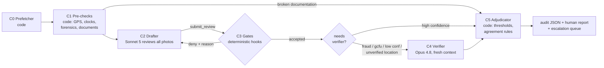

<div align="center">

# 🌱 Grass-Cut QA Agent

**An AI agent that audits grass-cut work orders end-to-end** — pulls the order and vendor photos from the Safeguard API, verifies the work really happened at the right property, and returns one of the three assignment outcomes with photo-cited evidence and a plain-language report a human can read in a minute.


*Built on the [Claude Agent SDK](https://code.claude.com/docs/en/agent-sdk/overview) (Python) · Full spec in [`Agent Docs/ORCHESTRATION.md`](Agent%20Docs/ORCHESTRATION.md) · Results of the live run on the 10 dev orders below and in [`results/`](results/)*

</div>

---

## The three outcomes (+ the anomaly marker)

The agent always commits to one of the assignment's three outcomes. Two independent extras ride along:

| Field | Values | Meaning |
|:--|:--|:--|
| `flag` | ✅ `good_to_pay` · 🔁 `gcfu` · 🚨 `potential_fraud` | The assignment decision, judged on **visible evidence** |
| `anomaly` | `true / false` | Fraud/integrity anomalies on record (itemized in `fraud_indicators`) — independent of the flag |
| `disposition` | `auto` · `human_review` | Who acts: code, or a person first |

So **`good_to_pay` + `anomaly: true` + `human_review`** is a first-class answer: *the work fits the standard, the paperwork problems are itemized, and a person confirms before payment releases.* Routing never erases the flag — an uncertain GCFU is "GCFU, human confirms", not a flagless escalation.

**Decision rules (the brief's, verbatim policy):**
- **Good to pay** — grass cut, property brought to standard, documentation reasonably supports meaningful work.
- **Potential fraud** — **any one prong suffices**: wrong property · not enough time on site to have realistically performed the claimed work · before/after photos show no meaningful work. Actions: label Potential Fraud, pay → $0, status → Quality Review.
- **GCFU** — specific areas remain out of standard, or photo coverage is incomplete to *visually* prove completion.

**Judging discipline:** visible evidence outranks both contractor claims *and* metadata. A staged before/after pairing is never credited as proof — but each photo stays valid evidence of the state it shows. Timestamp games go to `fraud_indicators`, not the flag; a *paying* order with staged evidence always requires human confirmation. The "good enough" standard applies throughout: fail completeness, never cosmetics.

> [!IMPORTANT]
> **Design constraint (from the brief):** an honest vendor falsely accused of fraud is the most expensive error — that confusion-matrix cell must stay ≈ 0, even at the cost of a few missed frauds. Fraud therefore also requires photo-cited evidence, a deterministic corroborating signal, and independent-verifier agreement — with one exception: the **time prong** fires on SafeGuard's own reported time-on-site field alone.

---

## Architecture

One order = one pass through a fixed, auditable pipeline. Code does the errands and enforces the rules; Claude judges the evidence.



| Stage | What it does |
|:--|:--|
| **C0 Prefetcher** *(code)* | Auth, fetch order + photos + documents (questionnaire/invoice/audit PDFs), curate ~30 of 205 fields — PII and lock codes never leave this stage |
| **C1 Pre-checks** *(code)* | GPS clustering + geocoded location match · photo forensics (sha256/dHash duplicates, staged before/after pairs, cross-station adjacency) · **three-clock analysis** (metadata capture UTC / upload time / on-image watermark local — upload-stamped capture times are detected and suppressed) · time-on-site, date skew, season, counts. Code can only ever short-circuit to *GCFU + human review* — never to fraud or pay |
| **C2 Drafter** *(Sonnet 5)* | Reviews every photo + document against the completion standards; must finish by calling `submit_review` |
| **C3 Gates** *(code, PreToolUse hooks)* | Deny non-compliant verdicts with an actionable reason fed back in-session. Fraud without photo evidence + deterministic corroboration is physically rejected. Narrative lint can never block a valid verdict |
| **C4 Verifier** *(Opus 4.8)* | Fresh session, same evidence, sees only the draft *outcome* — never the reasoning. Fraud is never confirmed without its agreement |
| **C5 Adjudicator** *(code)* | Confidence thresholds (YAML), agreement rules, disposition. Assembles `fraud_indicators` from deterministic signals + both reviewers |
| **C6 Eval harness** *(code)* | Golden-set replay, 3×3 flag confusion matrix, threshold sweep, regression gate |

**The agent's only tool is `submit_review`** — the verdict is a tool call so code can gate it deterministically, and the same schema serves the SDK path and the Message-Batches path so the two transports can never drift. The verdict includes `outcome`, honest `confidence`, `needs_human`, photo/field/signal/document-cited `evidence[]`, `checks`, `fraud_indicators[]`, `flag_reasons[]`, `review_items[]`, and a lint-gated ≤120-word `rationale_plain`.

---

## Live results — the 10 dev orders

Final-policy live run (Sonnet 5 drafter + Opus 4.8 independent verifier): **5 Good to pay · 4 GCFU · 1 Potential Fraud (verifier-confirmed)** — every order carries its itemized anomaly record; full machine-readable audit + human report per order in [`results/`](results/). Total cost $7.10 (~$0.71/order at standard rates).

The same 10 orders also ran through the real **Message Batches API** with identical prompts and gates ([`results/batch_compare.json`](results/batch_compare.json)): **10/10 flag agreement with the live run** — including the potential-fraud call on 500119022, independently confirmed by the batch verifier — at **$1.91 total ($0.19/order, 73% cheaper)**. Same schema, two transports, same answers.

| Order | Outcome | Anomalies | Verifier | Report |
|:--|:--|:--:|:--|:--|
| 500119014 | ✅ Good to pay | 8 | agrees | [report](results/500119014.md) |
| 500119015 | ✅ Good to pay | 14 | agrees | [report](results/500119015.md) |
| 500119016 | ✅ Good to pay | 9 | agrees | [report](results/500119016.md) |
| 500119017 | ✅ Good to pay | 11 | agrees | [report](results/500119017.md) |
| 500119018 | ✅ Good to pay | 13 | agrees | [report](results/500119018.md) |
| 500119019 | 🔁 GCFU | 8 | agrees | [report](results/500119019.md) |
| 500119020 | 🔁 GCFU | 10 | agrees | [report](results/500119020.md) |
| 500119022 | 🚨 Potential Fraud | 12 | **agrees — confirmed** | [report](results/500119022.md) |
| 500119023 | ✅ Good to pay | 10 | dissents: GCFU → human decides | [report](results/500119023.md) |
| 500119024 | 🔁 GCFU | 12 | agrees | [report](results/500119024.md) |

### Each order, in the assignment's output format

**Order 500119014**
- **Outcome:** Good to pay
- **Reasoning:** GPS cluster 3 m from the property, house number 1801 readable on the door; tall patchy grass in Before photos vs a uniform cut on all four sides plus foundation edging in After; 38 minutes on site fits the work. Anomalies: staged before/after timestamps on 4 stations; one photo of a different house 723 km away filed as "Rear of House".
- **Recommended actions:** Payment can proceed — after a human confirms (payment evidence is time-staged).

**Order 500119015**
- **Outcome:** Good to pay
- **Reasoning:** Location verified (5 m, house number 16812 visible); front and side yards show a real cut/striped/edged transformation. Anomalies: photo reuse and staged pairs.
- **Recommended actions:** Payment can proceed — after human confirmation.

**Order 500119016**
- **Outcome:** Good to pay
- **Reasoning:** GPS pass (125 m, all photos inliers); visible mowing difference with striping on every lawn; the overgrowth-impediment area behind the outbuilding shown fully mowed; audit items non-claimable/cosmetic. Anomalies: 10 staged pairs; one exact duplicate photo filed under two station labels; the "2-inch ruler" After photo was actually captured *before* mowing began.
- **Recommended actions:** Payment can proceed — after human confirmation.

**Order 500119017**
- **Outcome:** Good to pay
- **Reasoning:** GPS metadata is fallback junk (dozens of photos share one identical coordinate), but house number 6052 is readable — the brief's alternative location test; ruler photos show tall grass brought under 2 inches; all-sides coverage present. Anomalies: a stray photo of a door with address plaque "1801" — another dev order's address, suggesting cross-order photo reuse.
- **Recommended actions:** Payment can proceed — after human confirmation.

**Order 500119018**
- **Outcome:** Good to pay
- **Reasoning:** Location verified (101 m); every area including behind-outbuilding shows a short, even cut; During photos show mower/trimmer/edger actively engaged in the 29-minute visit. Anomalies: photo reuse, staged pairs, one foreign photo 1,076 km away with a CDT watermark in an EDT set.
- **Recommended actions:** Payment can proceed — after human confirmation.

**Order 500119019**
- **Outcome:** GCFU
- **Reasoning:** Debris (white pipe, wood) remains visible at the foundation in the After photo of the Rear Edging/Foundation station, and the vendor's own questionnaire confirms no debris-removal service was performed — a specific area left out of standard. Anomalies: staged pairs on 4 stations.
- **Recommended actions:** A GCFU work order is recommended.

**Order 500119020**
- **Outcome:** GCFU
- **Reasoning:** The station meant to prove front foundation/edging completion contains a photo of an unrelated urban property (Brooklyn GPS — the set's only GPS point — and an EDT watermark in a CDT set), and the heavily overgrown entry-gate hedge has no After photo at all: front completion is visually unproven. Rear/side lawns show real work at the verified property (house number 4168). This order's metadata capture times were upload-stamped — chronology came from the on-image watermarks.
- **Recommended actions:** A GCFU work order is recommended.

**Order 500119022**
- **Outcome:** 🚨 Potential fraud — confirmed by the independent verifier
- **Reasoning:** The contractor did not spend enough time on site to have realistically performed the claimed work: SafeGuard's own time-on-site field reports **6 minutes** for a 24,025 sq ft lot with claimed full multi-station coverage — the time prong fires on its own. Supporting: the After photo behind the outbuilding still shows uncut overgrown grass; staged before/after timestamps on 3 stations; a different house filed as "General Property Condition"; the questionnaire denies a pool that is clearly visible in two photos.
- **Recommended actions:** Label as Potential Fraud, reduce pay to $0, and move status to Quality Review.

**Order 500119023**
- **Outcome:** Good to pay *(independent verifier dissents: GCFU — a human decides)*
- **Reasoning:** Location verified (30 m, 81 photos); before/after mowing difference on all lawns and ruler compliance ≤ 2 inches. Anomalies: a staged pair; one photo 113 km away showing a riding mower while every other photo shows a push mower.
- **Recommended actions:** Payment can proceed only after a human resolves the reviewer disagreement.

**Order 500119024**
- **Outcome:** GCFU
- **Reasoning:** A mattress is visibly left under the deck in two After photos, violating the debris-removal impediment, and the Rear Lawn / Flower Bed / Behind-Outbuilding station photos do not depict those areas — completion there is visually unproven. Anomalies: the real photo set spans ~4 minutes against 623 claimed minutes; a foreign house photo 1,541 km away in the wrong timezone; staged pairs on 3 stations.
- **Recommended actions:** A GCFU work order is recommended.

---

## Why it's built this way

1. **A workflow, not a free-roaming agent.** The review has a fixed shape, so Python sequences it and the LLM runs inside two well-fenced stages. Predictable, auditable, cheap.
2. **The money decision is a gated tool call.** A PreToolUse hook validates every `submit_review` against pure-Python rules and denies bad ones with a reason the model corrects in-session.
3. **Independent verification where it's dangerous.** Fraud/GCFU/low-confidence/unverified-location drafts are re-reviewed from scratch by a stronger model that never sees the drafter's reasoning.
4. **Code computes facts, models judge evidence.** GPS clustering (medoid, never the mean — one 723 km outlier would drag a mean 17 km), duplicate hashing, timestamp forensics, and document extraction are deterministic; the models do vision and judgment.
5. **Everything is calibratable on outcomes.** Thresholds live in YAML; the eval harness replays a golden set into a 3×3 confusion matrix with a threshold sweep — exactly the "same 200 cases after every change" loop from the brief. Current thresholds are provisional until scored against the answer key.

## Run it yourself

```bash
git clone <this repo> && cd grass-cut-qa
uv venv && uv pip install -e ".[dev]"          # or: pip install -e ".[dev]"
cp .env.example .env                            # fill in Safeguard POC creds + Anthropic key

.venv/bin/python -m pytest -q                   # offline: 107 tests, no network, no spend
.venv/bin/python -m pytest -m live -q           # live smoke: Safeguard API only, no model spend

.venv/bin/python -m gcqa.run --order 500119014 --force        # one order (~$0.55-0.95)
#   -> runs/<YYYY-MM>/500119014.json  (audit record)
#   -> runs/<YYYY-MM>/500119014.md    (human-readable report)
.venv/bin/python -m gcqa.run --orders orders.txt --force      # batch of orders, concurrent

.venv/bin/python -m gcqa.eval --sweep           # confusion matrix + threshold sweep
.venv/bin/python -m gcqa.costcheck              # measured cost vs targets
.venv/bin/python -m gcqa.batch.compare --orders orders.txt    # same orders via Message Batches (~50% cheaper)
```

## Repository layout

```
gcqa/                 the agent: run.py (CLI/orchestration) · prefetch.py (C0) · prechecks.py + geo.py (C1)
                      review.py + prompt_builder.py + gates.py (C2-C4) · adjudicate.py (C5)
                      report.py + templates/ (human report) · eval/ (C6) · batch/ (Batch API path)
                      api_client.py · config.py · costcheck.py
prompts/              reviewer_v1.md (the judging policy) · verifier_v1.md (independence suffix)
config/qa.yaml        models, thresholds, pre-check tunables, cost targets — ops-editable
tests/                107 offline tests incl. the GPS matrix, photo forensics, gate rules (+ fixtures)
golden/golden.jsonl   eval answer-key template (schema for the ~200-order golden set)
Agent Docs/           ORCHESTRATION.md (full spec) · AGENT_BEST_PRACTICES.md · API_DOCUMENTATION.md
results/              the live run: per-order audit JSON + report MD, results.jsonl,
                      escalations.jsonl, summary.csv
```
